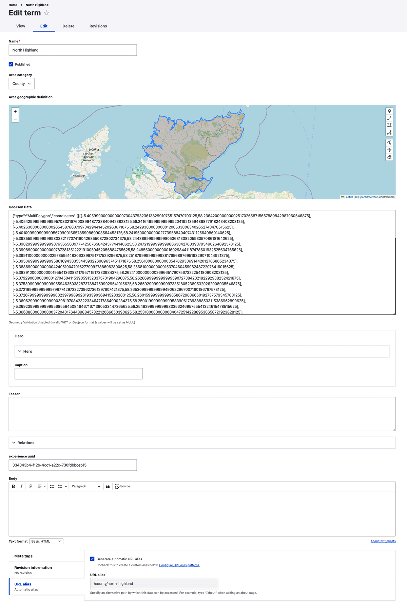

1. [Route map](route-content-type.md)
2. [Route landing page maps](route-landing-page-content-type.md)
3. [Paragraphs](paragraph-embeds.md)
4. [Modules](relevant-modules.md)
5. [Listings](listing-pages.md)
6. [Journey planner](journey-planner.md)
7. [The Drupal APIs](api.md)
8. [CAN map paragraph type](can.md)
9. [The embeds could use improvements](embed-improvement-notes.md)

# APIs to expose data to Richard F's service

The data required for mapping is made available to Richard's service with a few APIs, in json format.

The APIs have been built using views. The APIs take in data from the variety of relevant content types and
repackage the data in json format on specified urls. There are several APIs:

### Built in the view at /admin/structure/views/view/endpoints
- The primary API for content is [www.cyclinguk.org/api/v1](https://www.cyclinguk.org/api/v1)
    - This API holds the content types **Route**, **Post page**, **Group (workaround)**, and **Point of interest**.
- There is an Event API [www.cyclinguk.org/api/v1/event](https://www.cyclinguk.org/api/v1/event)
    - This API holds the **Event** content type.
    - This is separate because it adding it to the main API causes problems, it would cause the main API to crash.

### Built in the view at /admin/structure/views/view/endpoint_groups
Groups as usual are problematic. I cannot build a view that holds both Content and Groups because they are different types of entities in Drupal. So to get Group entity content into the main content API we've implemented an Ian workaround:

A Group API and Feeds are used to create standard Content type content using a Content type named Group (workaround).
- I built an API of actual Group entity content: [www.cyclinguk.org/api/v1/group-workaround](https://www.cyclinguk.org/api/v1/group-workaround) The view for this is at [/admin/structure/views/view/endpoint_groups/edit/rest_export_1](https://www.cyclinguk.org/admin/structure/views/view/endpoint_groups/edit/rest_export_1).
- That Group API is used as the feed url for a Groups workaround feed I built [/feed/16/edit](https://www.cyclinguk.org/feed/16/edit). The Feed imports every day into the Content type named Group (workaround), maintaining a list of groups with some essential group data as the standard Group (workaround) content type content. This then allows me to integrate Groups into the main API at [www.cyclinguk.org/api/v1](https://www.cyclinguk.org/api/v1).
- In my view this is a terrible idea.

### Areas
Yet another API to define areas. We began to develop "Areas" pages - areas such as a county - with the idea we would have county pages full of marvellous map embed. This one has a few parts I need to explain:
-  I defined a taxonomy vocabulary named Area. There are several fields on this vocabulary. Importantly, it has a field named **field_area_geographic_definition** which a Geofield to hold the data of the boundries of regions cycling uk wants, such as counties.  This was developed on the Experience site. The intention was to use the taxonomy term page for each of these regions as a public facing content page for that region. To that end, if you inspect the fields on this vocabulary you'll see it looks a lot like a landing page content type.  It was never fully developed, and even less on the main site. I now think this is a bad idea.
-  The API is at [www.cyclinguk.org/api/v1/area](https://www.cyclinguk.org/API/v1/area) which is built with the view at [/admin/structure/views/view/endpoints_taxonomy](admin/structure/views/view/endpoints_taxonomy)

