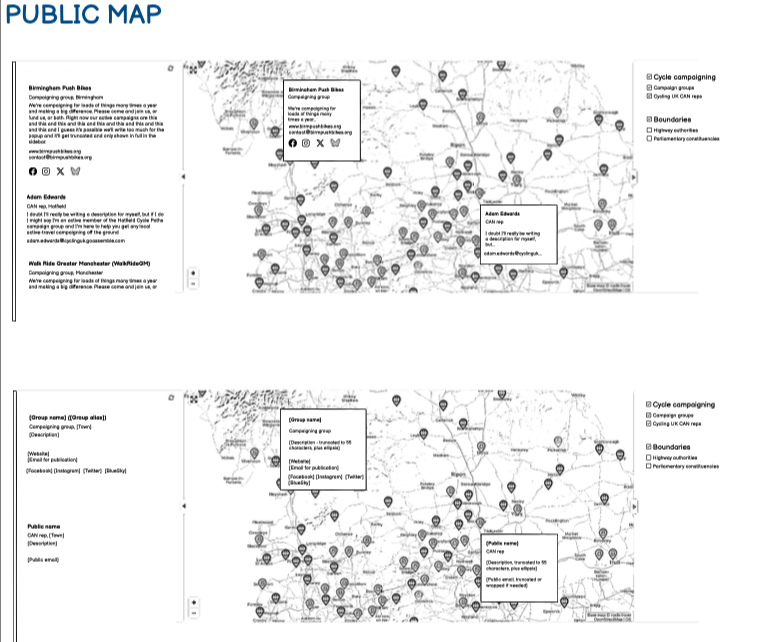
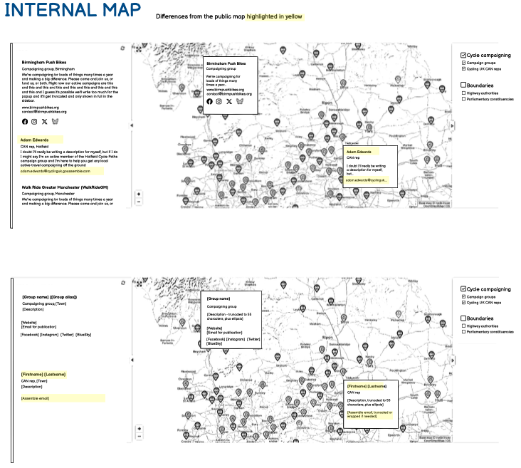
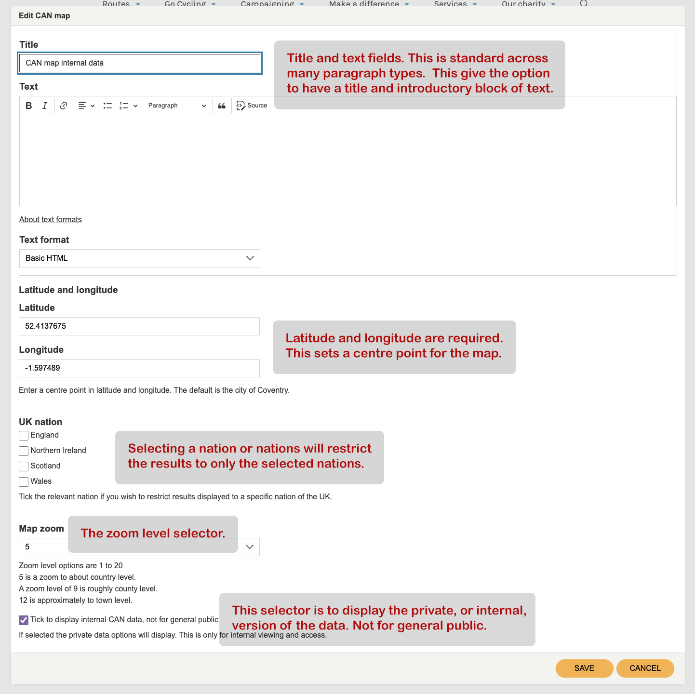

1. [Route map](route-content-type.md)
2. [Route landing page maps](route-landing-page-content-type.md)
3. [Paragraphs](paragraph-embeds.md)
4. [Modules](relevant-modules.md)
5. [Listings](listing-pages.md)
6. [Journey planner](journey-planner.md)
7. [The Drupal APIs](api.md)
8. [CAN map paragraph type](can.md)

## CAN maps to appear on these pages:

- [Main public CAN page at /cycle-campaigning/cycle-advocacy-network](https://www.cyclinguk.org/cycle-campaigning/cycle-advocacy-network) which uses the public names and email addresses.
- Stand alone Nations pages. Maps same as main public CAN page but filtered to only show pins for the nations England, Scotland, Wales, Northern Ireland.
- Password protected page with full firstname/lastname as well as Assemble email address.

## Sean's wireframe instruction:

### The public map:


### The private map:


## The build

I have built a CAN map paragraph type.  I could have made individual templates for the pages where it has been requested to have map embeds, but a paragraph type makes more sense because:
* Only have to build and maintain a single template.
* Don't have to be concerned and maintain templates for specific nodes, which could easily go out of sync with their related content type template.

###  CAN map paragraph type
The CAN map paragraph type has six fields:
1. Title
2. Text
    *   Introductory text blurb area
3. Latitude and longitude
    *   Set the centre point of the map
4. UK Nation
    *   Selecting a nation, or nations, will restrict the results to those nations selected.
5. Map zoom
6. Tick to display internal CAN data, not for general public
    *   This will alter what details are displayed, showing the private version of some of the data. For this reason it isn't for the general public.

#### The CAN map paragraph type user interface:


#### The paragraph twig:

paragraph--can-map.html.twig

```
{# // zoom level done via list text field #}


{# get the lat and long of the location #}



{# Internal data #}


{# build unique id for the div that houses the embed #}


{# attach Richard's assets using libraries in the map_embed module #}
{{ attach_library('cycle_travel_mapping/cycle_travel_mapping') }}


  <div{{ attributes.addClass(classes) }}>
    
      
        <h2 class="cuk-paragraph-title">{{ content.field_title.0 }}</h2>
      
      
        <div class="cuk-normal-text cuk-paragraph-narrow-column one-col mb-4 mb-md-5">
          {{ content.field_text.0 }}
        </div>
      
      <div id="{{ map_wrapper }}" class="mapframe"></div>
      <script>
        window.addEventListener("load", (event) => {
        initialiseMap('{{ map_wrapper }}', {
          lat: {{ locationLat }},
          lon: {{ locationLon }},
          preset: "campaigns",
          zoom: {{ zoomSetting }},
          scrollproof: true,
          nation: "{{ content.field_uk_nation.0['#title'] }}",
          auth: "c0f7cb083144ac40",
          
          }
        );
        })
      </script>
    
  </div>

```
## New dev server to understand

We now have a dev instance up and running at https://cycling-uk-dev.cycle.travel/ .

This pulls down content from stage.cyclinguk.org. Otherwise it behaves the same as the main instance, but we can choose to deploy new code there for testing before it goes into production. A handful of examples:

https://cycling-uk-dev.cycle.travel/maps/examples/index.html
https://cycling-uk-dev.cycle.travel/maps/examples/route.html
https://cycling-uk-dev.cycle.travel/maps/examples/simple_map.html
https://cycling-uk-dev.cycle.travel/maps/examples/raster_map.html

If you look at the browser console you'll see that these are fetching JSON content from cycling-uk-dev.cycle.travel or, for the route tiles, tile.cycle.travel/cycling_uk_dev .
