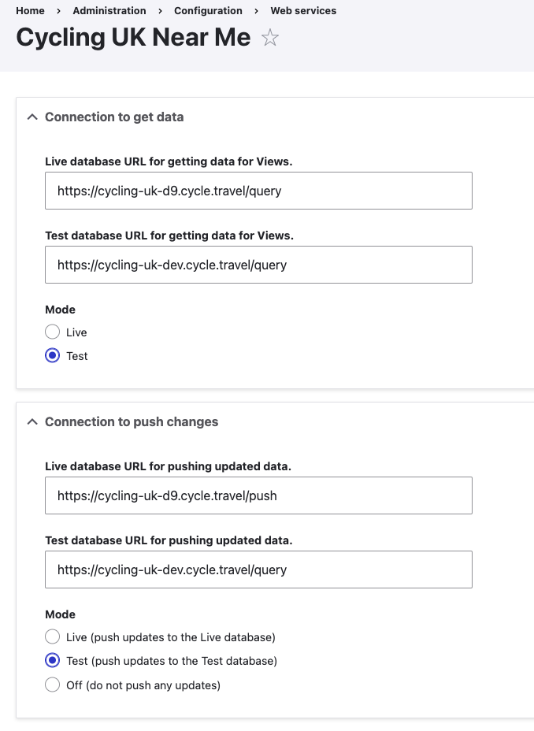

* Mapping
    1. [Route map](route-content-type.md)
    2. [Route landing page maps](route-landing-page-content-type.md)
    3. [Paragraphs](paragraph-embeds.md)
    4. [Modules](relevant-modules.md)
    5. [Listings](listing-pages.md)
    6. [Journey planner](journey-planner.md)
    7. [The Drupal APIs](api.md)
    8. [CAN map paragraph type](can.md)
    9. [The embeds could use improvements](embed-improvement-notes.md)
    10. [The mapping dev server](devserver.md)
    11. [Mapping - tag map paragraph type](tagmap.md)
* FundraiseUp
    1. [FundraiseUp wide image donate paragraph type](fundraiseup-wide.md)

# There is a mapping dev server

We now have a dev instance up and running at [cycling-uk-dev.cycle.travel](https://cycling-uk-dev.cycle.travel/).

This pulls down content from stage.cyclinguk.org. Otherwise it behaves the same as the main instance, but we can choose to deploy new code there for testing before it goes into production.

### A handful of examples:

https://cycling-uk-dev.cycle.travel/maps/examples/index.html
https://cycling-uk-dev.cycle.travel/maps/examples/route.html
https://cycling-uk-dev.cycle.travel/maps/examples/simple_map.html
https://cycling-uk-dev.cycle.travel/maps/examples/raster_map.html

If you look at the browser console you'll see that these are fetching JSON content from cycling-uk-dev.cycle.travel or, for the route tiles, tile.cycle.travel/cycling_uk_dev .

## Implemented on stage.cyclinguk.org

Richard's mapping and Drupal have been configured to use the development mapping instance when **on the stage server only**.

To make this work I've had to work on the **cycle_travel_mapping module** so that it will dynamically switch the source of the mapping libraries from the production libraries (which live at cycling-uk-d9.cycle.travel) to the development version of the libraries (which live at cycling-uk-dev.cycle.travel). Without this switching it will not work.

The switching logic uses hook_library_info_alter.  This can be found in the .module file for the curious. You can check which version of the libraries have loaded in the Sources tab in dev tools, which on stage.cyclinguk.org should have *cycling-uk-dev.cycle.travel* in the sources tab. If it doesn't then something is wrong.  In all other environments it will have cycling-uk-d9.cycle.travel as the source.

I have also built in this same style switch in the **rastermap_embed module**, so that should also work with the dev instance.

## GET and PUSH map data configuration

**IMPORTANT:** Anthony's Near me module contains some configuration settings which make the dev server of use.

stage.cyclinguk.org/admin/config/services/cyclinguk_nearme

At https://stage.cyclinguk.org/admin/config/services/cyclinguk_nearme you set the mode to either Live or Test for both getting data and pushing data.  When on the stage server, be sure to **set the get and push modes to Test**, and that the get and push urls are set to the dev versions, as follows:

* **Test database URL for getting data for Views**: https://cycling-uk-dev.cycle.travel/query
* **Test database URL for pushing updated data**: https://cycling-uk-dev.cycle.travel/query

These are the settings which permit you to upload a gpx to stage and see that route in a map on stage, they make it work, together with the alternate dev source of the libraries brought in by the cycle_travel_mapping module.

