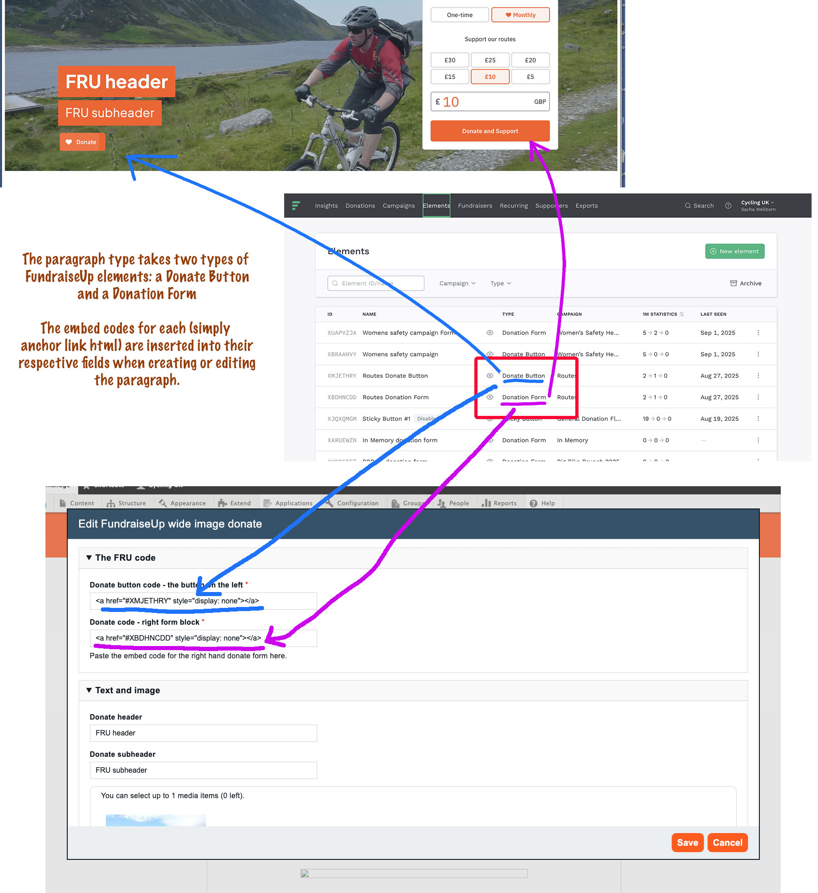

* Mapping
    1. [Route map](route-content-type.md)
    2. [Route landing page maps](route-landing-page-content-type.md)
    3. [Paragraphs](paragraph-embeds.md)
    4. [Modules](relevant-modules.md)
    5. [Listings](listing-pages.md)
    6. [Journey planner](journey-planner.md)
    7. [The Drupal APIs](api.md)
    8. [CAN map paragraph type](can.md)
    9. [The embeds could use improvements](embed-improvement-notes.md)
    10. [The mapping dev server](devserver.md)
    11. [Mapping - tag map paragraph type](tagmap.md)
* FundraiseUp
    1. [FundraiseUp wide image donate paragraph type](fundraiseup-wide.md)

# FundraiseUp wide image donate paragraph type

Currently only available for use on the Landing Page content type.

The FundraiseUp wide image donate paragraph type requires:

* A suitable image to use for the background, one that can comfortably go edge to edge and has its subject area in the central portion of the image. You can only select and place an image.  There is no the 'focal point' functionality like we have on hero images.
* A headline
* A sub-headline
* Suitably configured line of embed code for a donate button. This is obtained from the FundraiseUp backend.
* Suitably configured line of embed code for a donate form. This is obtained from the FundraiseUp backend.

#### The button and form embeds in the paragraph:

