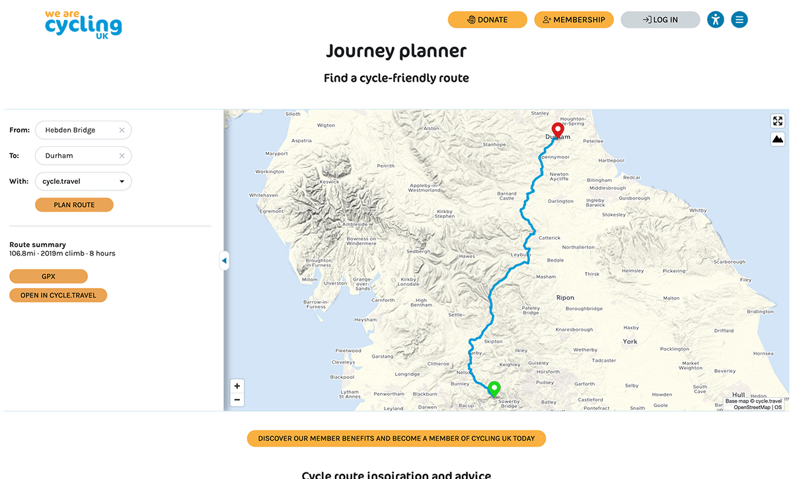

1. [Route map](route-content-type.md)
2. [Route landing page maps](route-landing-page-content-type.md)
3. [Paragraphs](paragraph-embeds.md)
4. [Modules](relevant-modules.md)
5. [Listings](listing-pages.md)
6. [Journey planner](journey-planner.md)
7. [The Drupal APIs](api.md)
8. [CAN map paragraph type](can.md)
9. [The embeds could use improvements](embed-improvement-notes.md)
10. [The mapping dev server](devserver.md)
11. [Mapping - tag map paragraph type](tagmap.md)

# Journey planner
The <a href="https://www.cyclinguk.org/journey-planner" target="_blank">journey planner</a> is an embed provided by Richard which has it's own individual node twig template at themes/custom/cyclinguk/templates/node/node--796896--full.html.twig

#### A portion of the twig template:

#### The journey planner:

