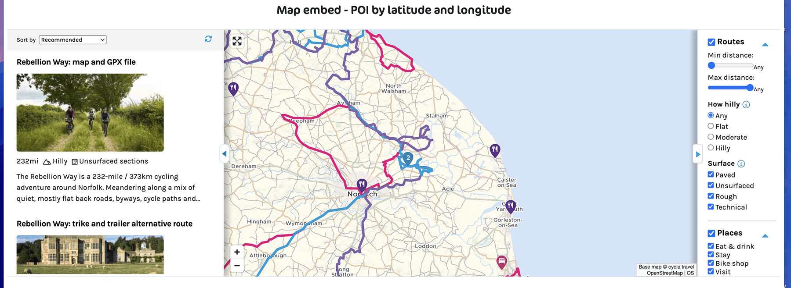
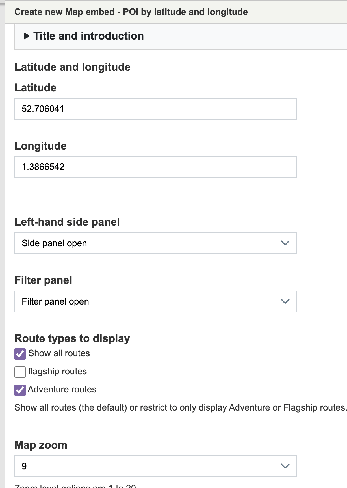
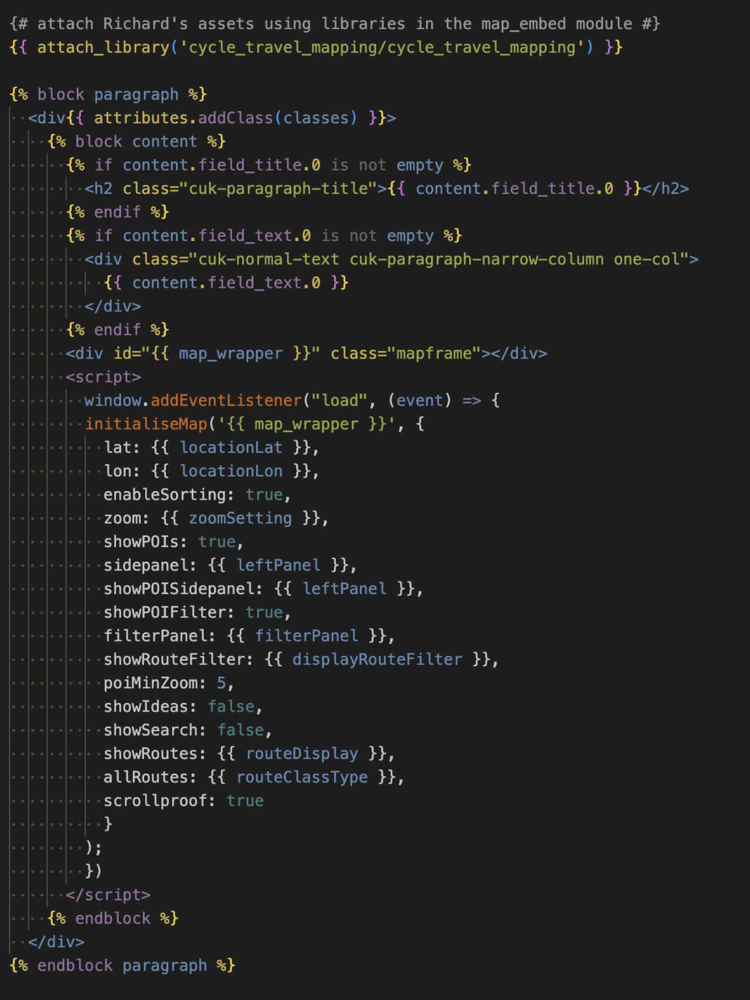

1. [Route map](route-content-type.md)
2. [Route landing page maps](route-landing-page-content-type.md)
3. [Paragraphs](paragraph-embeds.md)
4. [Modules](relevant-modules.md)
5. [Listings](listing-pages.md)
6. [Journey planner](journey-planner.md)
7. [The Drupal APIs](api.md)
8. [CAN map paragraph type](can.md)
9. [The embeds could use improvements](embed-improvement-notes.md)
10. [The mapping dev server](devserver.md)
11. [Mapping - tag map paragraph type](tagmap.md)

# Map embeds using paragraph types
On the EXPERIENCE site I developed a handful of paragraph type so that content editors could embed various types of maps onto any page that uses paragraphs.

On the main cycling uk site there are several similar paragraph types, however they are not fully developed and they are not in use. At the time of site migration these were de-prioritised, which has been their state ever since.

I did quickly put together another map embed paragraph type "Map embed - POI by latitude and longitude" at some point in the past year when Andy had to do some type of demonstration.  It also is not fully developed.

To develop the paragraph types to embed maps I would appreciate a re-defenition of what the requirements are, what types of embeds are needed.  I would like this to attempt to re-build these, hopefully not alone, to create a more useful tool.

Below are the existing map embed paragraph types:
- Map - multiple route reference embed **map_multiple_route**
- Map embed - POI by latitude and longitude **map_embed_poi_by_lat_lon**
- Map embed by content reference **map_embed_content_reference**
    - *Embed a map showing content that is based around a piece of content.*
- Map embed by location **map_embed_location**
    - *Embed a map showing content that is based around a location.*
- Map embed by proximity **map_embed_proximity**
    - *Embed a map showing content that is based Near Me.*

#### A map embedded with a map embed paragraph type:

#### Typical fields to complete in a map embed paragraph:

#### Twig of a map embed paragraph type:

