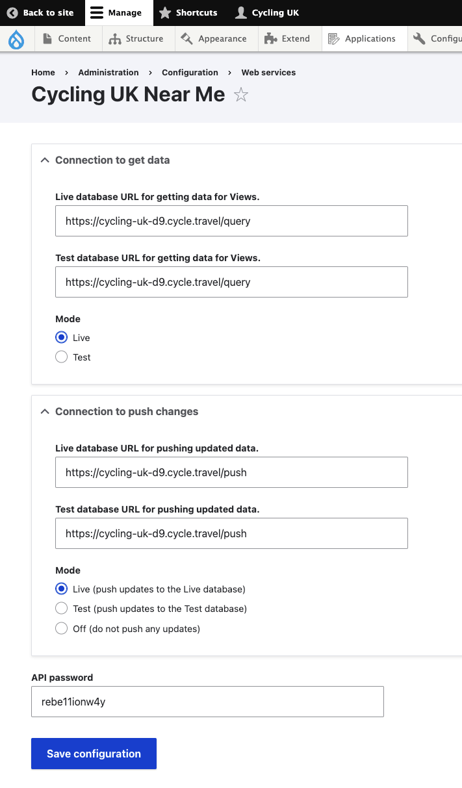

1. [Route map](route-content-type.md)
2. [Route landing page maps](route-landing-page-content-type.md)
3. [Paragraphs](paragraph-embeds.md)
4. [Modules](relevant-modules.md)
5. [Listings](listing-pages.md)
6. [Journey planner](journey-planner.md)
7. [The Drupal APIs](api.md)
8. [CAN map paragraph type](can.md)
9. [The embeds could use improvements](embed-improvement-notes.md)
10. [The mapping dev server](devserver.md)

# Modules
Anthony’s modules and what they do

## cyclinguk_gpxdata (in custom directory)
This module simply sends data to Richard's world for quick analysis which is then returned to fill in some of the route data fields on the **route content type**.

## nearme (in contrib directory)
Queries Richard's database to produce views with contain an embedded map and attached views list of returned data.  Has custom display format of Richards map to use in views.

The Near Me module gives the ability to create a number of views of different mapping related content. These are Area, Route, POI, Event, Group, and Post content. Currently we have four:

* Near me page: [/near-me](https://www.cyclinguk.org/near-me)
* Routes page: [/route-listing](https://www.cyclinguk.org/route-listing)
* Events page: [/event-listing-decommissioned](https://www.cyclinguk.org/event-listing-decommissioned) (this is not currently being used because we did not have the smarts to come up with a good way to configure the map together with the list attachment. So so replacement is at [/event-listing](https://www.cyclinguk.org/event-listing))
* Groups and clubs: [/group-listing](https://www.cyclinguk.org/group-listing)

We don't have the list attachment view enabled on any of the above views. We should revisit that. It could be we simply never understood the existence of and how to use the arguments with the attached list view.

The view is at [cyclinguk.org/admin/structure/views/view/near_me/edit/page_1](https://www.cyclinguk.org/admin/structure/views/view/near_me/edit/page_1)

## Other job
The Near Me module also does the work to get gpx data into Richard's database on saving of route content type data, so in theory maps should appear relatively quickly following content save.

## Configuration
There is a configuration page for the Cycling UK Near Me module.

[cyclinguk.org/admin/config/services/cyclinguk_nearme](https://www.cyclinguk.org/admin/config/services/cyclinguk_nearme)

It has settings to handle get and push for live and test mapping databases. Also has an off button to not push.

#### configuration page:


## To do

Anthony mentions that there should be further work done to the modules to make the libraries dynamic - so that when on the dev mapping the libraries used are dev versions of the libraries, and when on prod the libraries are prod version.

I need to add the gpxdata module to github and figure out the correct way to wire it up via composer with the site codebase.


## Sacha’s modules and what they do
The modules I put together related to mapping are to introduce the required libraries. That means the modules make available the necessary javascript and css for the maps to function and look ok. The main one is the **cycle_travel_mapping** module. I makes available the css, which as seen below we are hosting locally, and the variety of remote javascript:

```cycle_travel_mapping:
  css:
    base:
      css/maplibre-gl.css: { minified: true }
      css/autocomplete-theme-classic.css: { minified: true }

    layout:
      css/prototype.css: {}
      css/responsive.css: {}

  js:
    https://cycling-uk-d9.cycle.travel/maps/third_party/maplibre-gl.js: { type: external}
    https://cycling-uk-d9.cycle.travel/maps/third_party/autocomplete.js: { type: external }
    https://cycling-uk-d9.cycle.travel/maps/third_party/uPlot.js: { type: external}
    https://kit.fontawesome.com/9a2e8d8cca.js: { type: external, attributes: { crossorigin: anonymous } }
    https://cycling-uk-d9.cycle.travel/maps/cycling_uk/scripts/app_bundle.js: { attributes: { type: module } }
```

  - **cycle_travel_mapping** ```{{ attach_library('cycle_travel_mapping/cycle_travel_mapping') }}```
  - **rastermap_embed** ```{{ attach_library('rastermap_embed/rastermap') }}```
  - **simplemap_embed**
