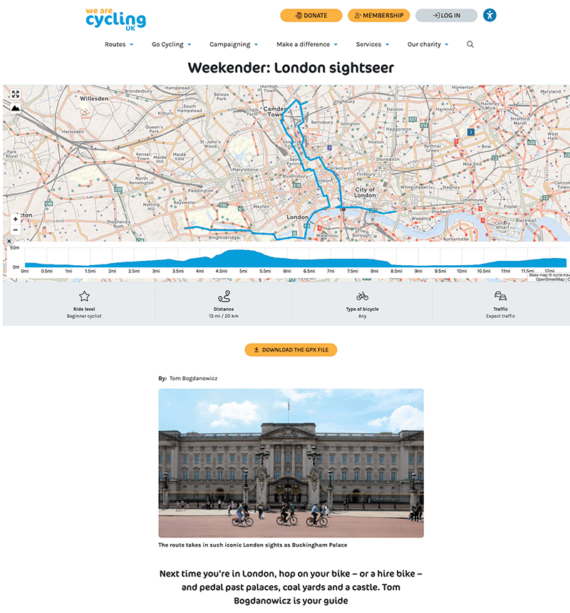
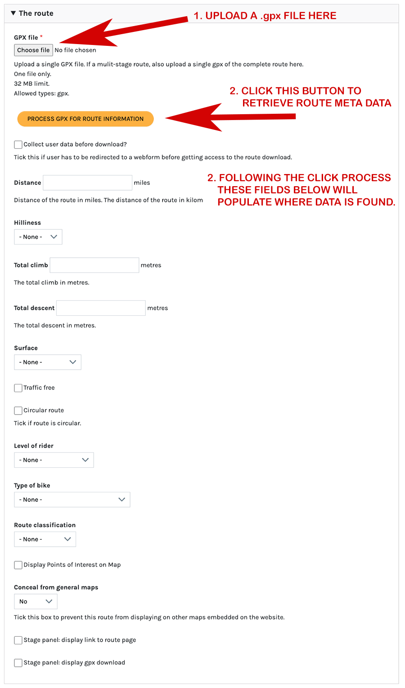
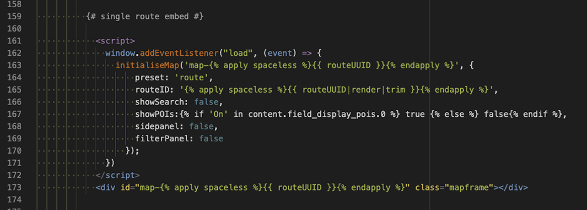

1. [Route map](route-content-type.md)
2. [Route landing page maps](route-landing-page-content-type.md)
3. [Paragraphs](paragraph-embeds.md)
4. [Modules](relevant-modules.md)
5. [Listings](listing-pages.md)
6. [Journey planner](journey-planner.md)
7. [The Drupal APIs](api.md)
8. [CAN map paragraph type](can.md)
9. [The embeds could use improvements](embed-improvement-notes.md)
10. [The mapping dev server](devserver.md)

# Route content type

The route content type is the primary place where Cycling UK routes are displayed on a map. `/admin/structure/types/manage/route/fields`

## Map on a route page

Uploading the gpx file is a requirement of a route page. There are a few steps for this, which sit within "The route" tab on the page edit form.

1. Click the `Choose file` button to browse to find your gpx file and upload it.
2. After the file is uploaded click the yellow button `PROCESS GPX FOR ROUTE INFORMATION`. This will send the gpx data to the mapping server for analysis and with any luck return some data to populate the route meta data fields below. The meta data fields can also be updated manually if necessary.

___

## The code behind the scenes

This relies on the Richard F's mapping service which is a codebase seperate to the Drupal website.  On the website we import a series of tools (libraries) and have built a template to embed the map created on Richard's server into the Drupal webpage. We have built a user interface to interact with the embed code present in the template.

The required Libraries for the route content type depend on `cycle_travel_mapping`, a simple module I put together.  The module makes the remote libraries available to the Drupal ecosystem.

The libraries have to be attached to the route content type. There are a variety of ways to do this.  I chose to attach the required libries in the content type twig template, which you can see near the top of the template. It is the single twig curly brace wrapped line `attach_library('cycle_travel_mapping/cycle_travel_mapping')`.

The map embed for the route content type is the simplest of the variety of possible embeds on the site. The embed follows a structure which requires some specific data, for which I've made a number of variable which are introduced into the node via the Drupal user interface as well as from Richard F's system, which itself gets its data from our Drupal mapping APIs.

From the Route template, this is the twig that builds up the embed that inserts the route map:

The fat grey boxes below the map with the meta data get their values form the meta data that is pulled in when the `PROCESS GPX FOR ROUTE INFORMATION` was clicked in the page creation, or later page edit (the values can also be entered manually on edit if required).
