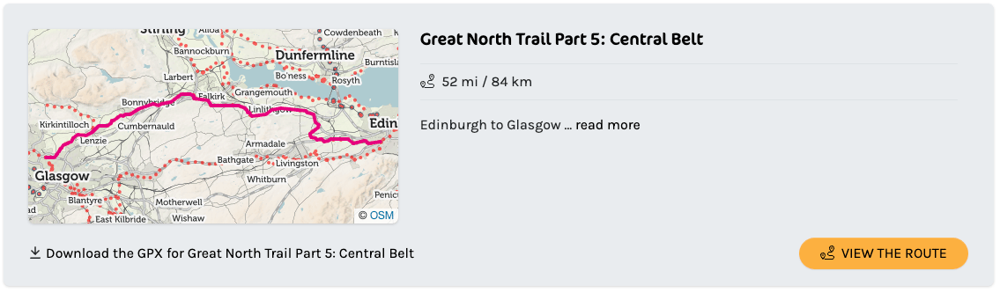
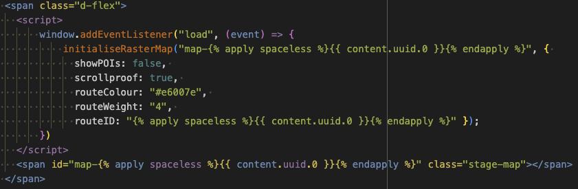
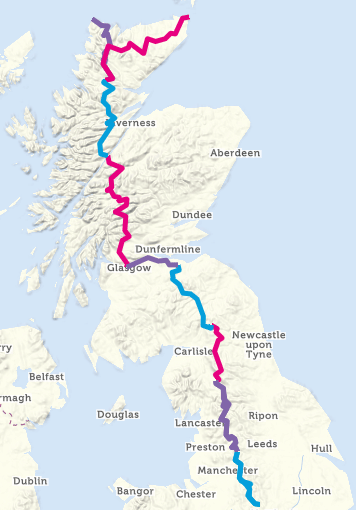
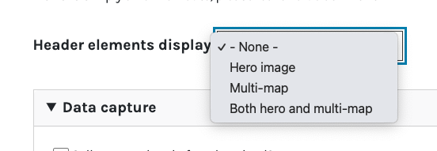
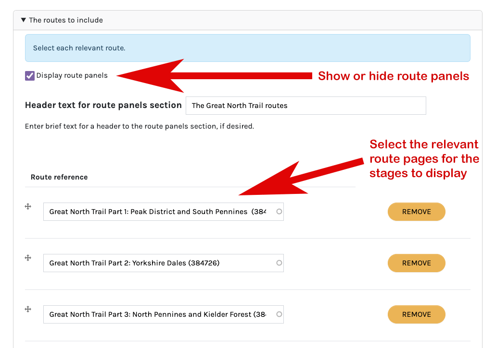
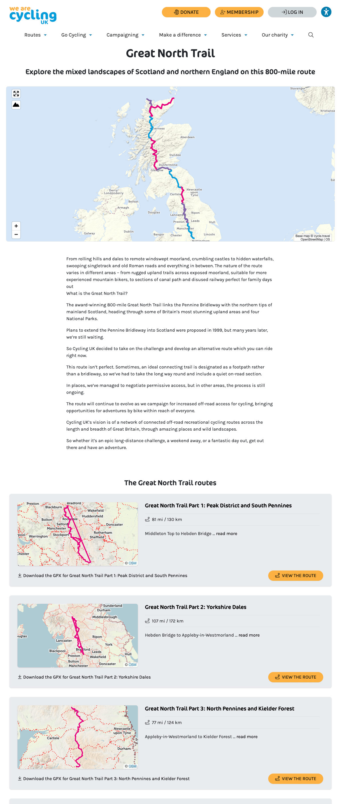

1. [Route map](route-content-type.md)
2. [Route landing page maps](route-landing-page-content-type.md)
3. [Paragraphs](paragraph-embeds.md)
4. [Modules](relevant-modules.md)
5. [Listings](listing-pages.md)
6. [Journey planner](journey-planner.md)
7. [The Drupal APIs](api.md)
8. [CAN map paragraph type](can.md)
9. [The embeds could use improvements](embed-improvement-notes.md)

# Route landing page
The route landing page has two different types of map embeds which can display.

First understand the context of Route landing page content. It has been developed to diplay multi-staged routes (for example the King Alfred's Way). It will digest the individual stages of a route from each stage's respective piece of Route content. Translation - each stage must first exist as Route content type content (gpx uploaded, processed and published using the [Route content type](route-content-type.md).

## Route stage panels
The Route landing page content type depends on that to be able to display small maps of each stage in horizonal panels. The content on these panels is pulled in from each individual stage's Route content page. It will retrieve available meta data, the gpx download link, the link to the Route content, as well as descriptive text. The Route content type has toggles to hide or display the gpx download and the link to content links:

The panel has a dedicated twig template `node--route-stage-panel.html.twig`. The panel uses a map type called a Rastermap, which uses an RasterMap embed type. This requires a different library and in the twig template this library is inserted with the line `attach_library('rastermap_embed/rastermap')`. The rastermap library is made available by the custom module `rastermap_embed`. The embed portion of the twig is similar to the route embed, but with reference to RasterMap:

The twig continues to enable displaying of the meta data and the discriptive text, as well links to the source node and gpx file.  For the descriptive text the template first trys to pull in the teaser text. If that is not available it will then pull in a portion of the main content text.  The descriptive text is restricted to either 800 or 900 characters. If that length proves to be not a good choice we can update it.

## The multimap
The Route landing page content type depends on each stage existing as Route content type content to be able to display a large map that we can call a multimap. It's a map which takes the individual stage gpx data and assembles a large map with all stages on display in alternating colours. When chosen to display, the mulitmap will display as a hero at the top of the page.

Content editors can choose to display the hero area mulitmap, a standard hero image, or both.  This choice is made with the `Header elements display` field:

## Associating the route stages to the page
Content editors use the `Route reference` field to select the relevant route stages, which should previoulsy been uploaded as Route content type content.

Users can also choose to display or to hide the stage panels with the `Display route panels` toggle.

Potentially a Route landing page can hold a lot of content and several maps.

